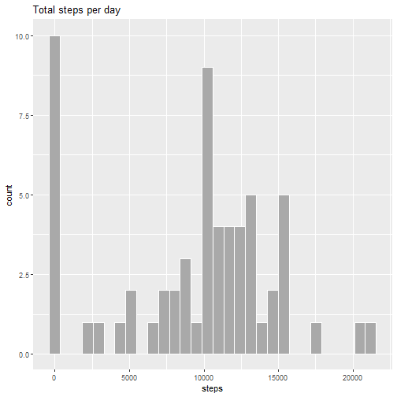
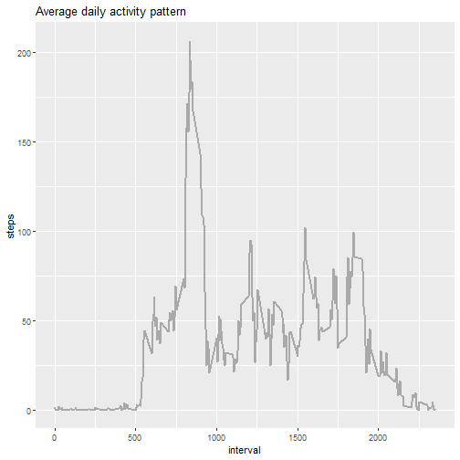
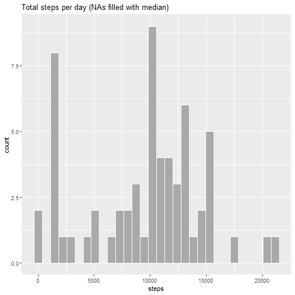
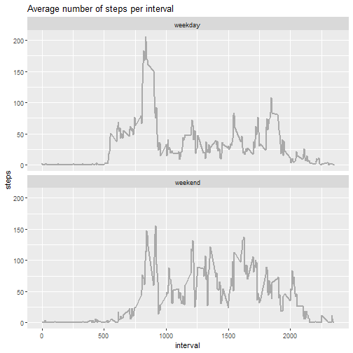

## Loading and preprocessing the data


```r
# load packages
library("tidyverse")
library("ggplot2")

# remove scientific notation
options(scipen=999)

# unzip data
if (!file.exists("activity.csv")) {
    unzip("activity.zip")
}

# load data
activity_data <- read.csv("activity.csv") %>% 
    mutate(date = as.Date(date))
```

## What is mean total number of steps taken per day?


```r
steps_per_day <- activity_data %>% 
    group_by(date) %>% 
    summarise(steps = sum(steps, na.rm = TRUE))

steps_mean <- mean(steps_per_day$steps)
steps_median <- median(steps_per_day$steps)

ggplot(steps_per_day, aes(x=steps)) +
    geom_histogram(color = "white", fill = "darkgrey") +
    labs(
        title = "Total steps per day"
    )
```



The **mean** of total steps taken per day is **9354**.  
The **median** of total steps taken per day is **10395**.

## What is the average daily activity pattern?


```r
avg_day <- activity_data %>% 
    group_by(interval) %>% 
    summarise(steps = mean(steps, na.rm = TRUE))

max_steps_interval <- avg_day %>% 
    filter(steps == max(steps)) %>% 
    .$interval

ggplot(avg_day, aes(x=interval, y=steps)) +
    geom_line(color = "darkgrey", lwd = 0.8) +
    labs(
        title = "Average daily activity pattern"
    )
```



Interval **835** contains, on average, the **maximum number** of steps.

## Imputing missing values

Strategy for filling in missing values: use median of that 5-minute interval.


```r
total_nas <- activity_data %>% 
    filter(is.na(steps) | is.na(date) | is.na(interval)) %>% 
    nrow()

data_filled_nas <- activity_data %>% 
    group_by(interval) %>% 
    mutate(steps = ifelse(is.na(steps), median(steps, na.rm = TRUE), steps)) %>% 
    ungroup()

steps_per_day_filled_nas <- data_filled_nas %>% 
    group_by(date) %>% 
    summarise(steps = sum(steps, na.rm = TRUE))

steps_mean_filled_nas <- mean(steps_per_day_filled_nas$steps)
steps_median_filled_nas <- median(steps_per_day_filled_nas$steps)

ggplot(steps_per_day_filled_nas, aes(x=steps)) +
    geom_histogram(color = "white", fill = "darkgrey") +
    labs(
        title = "Total steps per day (NAs filled with median)"
    )
```



The total **number of missing values** is **2304**.  

The **mean** of total steps taken per day is **9504** when using imputed data.  
The **median** of total steps taken per day is **10395** when using imputed data.  

Therefore, the **difference** in the **mean** is **150** steps compared to the data set without where the NAs have been omitted and **0** steps for the **median**.  

Due to the fact that the NAs are filled with the median of the interval, the mean is "pulled" towards the median. 


## Are there differences in activity patterns between weekdays and weekends?


```r
week_activity <- data_filled_nas %>%
    mutate(week_period = weekdays(date)) %>% 
    mutate(week_period = ifelse(week_period %in% c("Saturday", "Sunday"), "weekend", "weekday")) %>% 
    mutate(week_period = as.factor(week_period)) %>% 
    group_by(week_period, interval) %>% 
    summarise(steps = mean(steps))
    
ggplot(week_activity, aes(x=interval, y=steps)) +
    geom_line(color = "darkgrey", lwd = 0.8) +
    facet_wrap(. ~ week_period, nrow = 2) +
    labs(title = "Average number of steps per interval")
```




